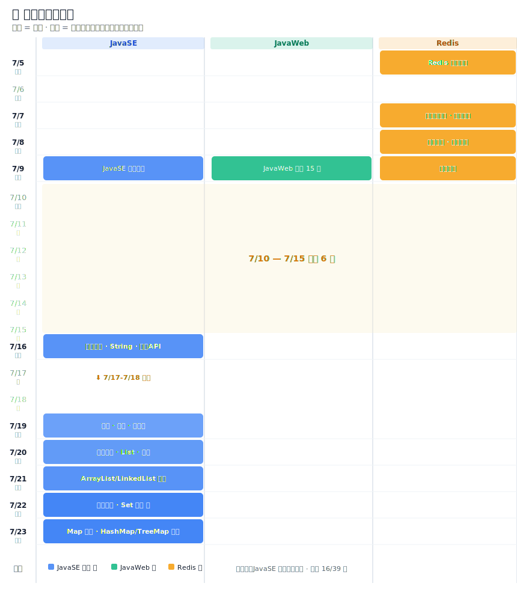

# 学习笔记

> 📚 基于黑马程序员课程，按知识板块整理的学习笔记。
> 内容使用 AI 辅助生成和润色。

---

## 📂 目录

### Java SE

| 序号 | 内容 | 完成时间 |
|------|------|----------|
| [01 - Java 初入门](./JavaSE/01-Java初入门.md) | JDK/JRE/JVM、环境搭建、HelloWorld、注释、关键字与标识符 | 2026-07-09 |
| [02 - 变量与运算符](./JavaSE/02-变量与运算符.md) | 8 种基本类型、类型转换、算术/比较/逻辑/三元运算符、Scanner | 2026-07-09 |
| [03 - 流程控制语句](./JavaSE/03-流程控制语句.md) | if/switch、for/while/do-while、break/continue | 2026-07-09 |
| [04 - 数组](./JavaSE/04-数组.md) | 数组初始化、遍历、常见操作、冒泡排序、二维数组 | 2026-07-09 |
| [05 - 方法](./JavaSE/05-方法.md) | 方法定义/调用、重载、参数传递（值传递）、递归 | 2026-07-09 |
| [06 - Java 运行原理](./JavaSE/06-Java运行原理.md) | 编译与运行、JVM 内存模型、类加载（双亲委派）、GC 简介 | 2026-07-09 |
| [07 - 面向对象编程](./JavaSE/07-面向对象编程.md) | 类与对象、封装、this、构造方法、标准 JavaBean、ArrayList、学生管理系统 | 2026-07-16 |
| [08 - 字符串(String)](./JavaSE/08-字符串(String).md) | String 创建/比较/API、不可变性、StringBuilder、StringJoiner | 2026-07-16 |
| [09 - 常用 API](./JavaSE/09-常用API.md) | Math/System/Runtime/Object、BigInteger/BigDecimal | 2026-07-16 |
| [10 - 对象克隆与深浅拷贝](./JavaSE/10-对象克隆与深浅拷贝.md) | Object.clone()、Cloneable、浅拷贝/深拷贝、序列化深拷贝 | 2026-07-19 |
| [11 - 正则表达式](./JavaSE/11-正则表达式.md) | 正则规则、Pattern/Matcher、分组、爬虫匹配 | 2026-07-19 |
| [12 - 时间日期类](./JavaSE/12-时间日期类.md) | Date/Calendar、SimpleDateFormat、JDK8 新日期 API(LocalDate/LocalDateTime) | 2026-07-19 |
| [13 - 泛型与集合框架(List)](./JavaSE/13-泛型与集合框架(List).md) | 泛型(类/方法/接口/通配符/擦除)、数据结构(栈/队列/数组/链表)、ArrayList源码、LinkedList源码、迭代器 | 2026-07-21 |
| [14 - 集合进阶（一）](./JavaSE/14-集合进阶（一）.md) | Collection/List 体系、ArrayList/LinkedList 源码、泛型、三种遍历方式 | 2026-07-20 |
| [15 - 集合进阶（二）](./JavaSE/15-集合进阶（二）-数据结构与Set集合.md) | 数据结构(二叉树/平衡二叉树/红黑树)、HashSet/LinkedHashSet/TreeSet | 2026-07-22 |

### JavaWeb

| 序号 | 内容 | 完成时间 |
|------|------|----------|
| [01 - 前端基础(HTML+CSS)](./javaweb/01-前端基础(HTML+CSS).md) | HTML 常用标签、CSS 选择器、盒子模型、Flexbox 布局 | 2026-07-09 |
| [02 - 前端基础(JS+Vue+Ajax)](./javaweb/02-前端基础(JS+Vue+Ajax).md) | JS 核心语法、DOM 操作、Vue 指令、Axios 异步请求 | 2026-07-09 |
| [03 - Maven 基础与高级](./javaweb/03-Maven基础与高级.md) | 坐标/依赖/生命周期、JUnit、分模块、继承/聚合、私服 | 2026-07-09 |
| [04 - SpringBoot 入门与 HTTP 协议](./javaweb/04-SpringBoot入门与HTTP协议.md) | SpringBoot 初体验、HTTP 请求/响应、三层架构、IOC/DI | 2026-07-09 |
| [05 - MySQL 数据库与多表查询](./javaweb/05-MySQL数据库与多表查询.md) | DDL/DML/DQL、多表关系、内连接/外连接、子查询 | 2026-07-09 |
| [06 - JDBC 与 MyBatis](./javaweb/06-JDBC与MyBatis.md) | JDBC 流程、MyBatis 注解/XML、动态 SQL、多环境配置 | 2026-07-09 |
| [07 - 部门管理 CRUD 实战](./javaweb/07-部门管理CRUD实战.md) | 前后端分离、统一响应格式、日志技术(Logback) | 2026-07-09 |
| [08 - 员工管理实战(上)](./javaweb/08-员工管理实战(上).md) | 新增员工、事务管理(ACID/@Transactional)、文件上传(OSS) | 2026-07-09 |
| [09 - 员工管理实战(下)](./javaweb/09-员工管理实战(下).md) | 分页查询(PageHelper)、批量删除、修改回显、全局异常处理 | 2026-07-09 |
| [10 - 登录认证与 JWT](./javaweb/10-登录认证与JWT.md) | Cookie/Session 演进、JWT 令牌、Filter/Interceptor、ThreadLocal | 2026-07-09 |
| [11 - AOP 面向切面编程](./javaweb/11-AOP面向切面编程.md) | AOP 概念、通知类型、切入点表达式、操作日志案例 | 2026-07-09 |
| [12 - SpringBoot 原理](./javaweb/12-SpringBoot原理.md) | 自动配置、@Conditional、Starter 起步依赖、启动流程 | 2026-07-09 |
| [13 - Vue 工程化与 ElementPlus](./javaweb/13-Vue工程化与ElementPlus.md) | Vite 工程、.vue 组件、Vue Router、Element Plus 常用组件 | 2026-07-09 |
| [14 - 前端 Tlias 案例实战](./javaweb/14-前端Tlias案例实战.md) | 部门/员工 CRUD 页面、登录页、路由守卫、前后端联调 | 2026-07-09 |
| [15 - 项目部署(Linux+Docker)](./javaweb/15-项目部署(Linux+Docker).md) | Linux 常用命令、Jar 包部署、Nginx 代理、Docker/Docker Compose | 2026-07-09 |

### Redis 缓存

| 序号 | 内容 | 完成时间 |
|------|------|----------|
| [01 - 认识 Redis](./redis缓存/01-认识Redis.md) | Redis 介绍、数据类型、常用命令 | 2026-07-05 |
| [02 - 缓存穿透/雪崩/击穿](./redis缓存/02-缓存穿透雪崩击穿.md) | 三大缓存问题及解决方案 | 2026-07-05 |
| [03 - 优惠券秒杀](./redis缓存/03-优惠券秒杀.md) | 全局唯一ID、RedisIdWorker、超卖问题、乐观锁/悲观锁、一人一单 | 2026-07-07 |
| [04 - 分布式锁](./redis缓存/04-分布式锁.md) | SETNX 演进路线、UUID + Lua 原子解锁、Redisson（WatchDog/可重入/RedLock） | 2026-07-07 |
| [05 - 秒杀优化与消息队列](./redis缓存/05-秒杀优化与消息队列.md) | Lua 脚本前置判断、异步下单、Redis 消息队列（List/PubSub/Stream）、消费者组 | 2026-07-08 |
| [06 - 达人探店](./redis缓存/06-达人探店.md) | 发布探店笔记、图片上传、点赞/取消点赞、SortedSet 点赞排行榜 | 2026-07-09 |

---

## 📊 学习历程时间线

> 从上到下按时间排列，每天学什么一目了然。

