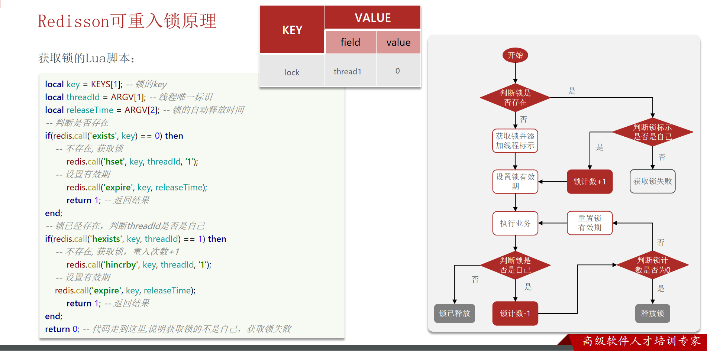
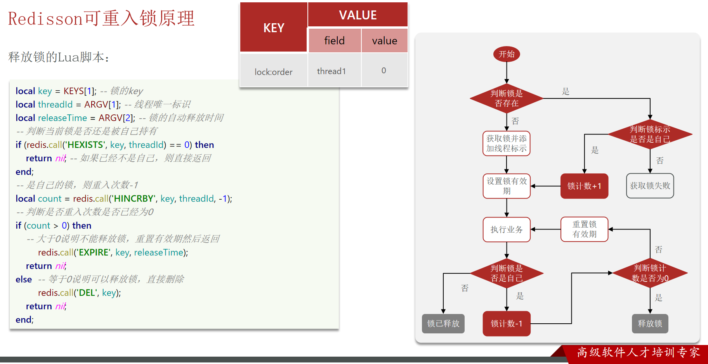

# 04 - 分布式锁

## 1. 为什么需要分布式锁？

### 1.1 问题回顾：超卖与一人一单

上一章中我们使用 `synchronized` 或 `Lock` 在**单机模式**下解决了：
- **超卖问题**：多线程并发扣减库存
- **一人一单**：同一个用户不能重复下单

### 1.2 集群模式下的问题

```
┌─────────────────────────────────────────┐
│              Nginx (负载均衡)              │
│            轮询分发请求到不同节点              │
└─────────────────────────────────────────┘
           │                   │
           ▼                   ▼
   ┌──────────────┐    ┌──────────────┐
   │  服务 A (8081) │    │  服务 B (8082) │
   │  JVM 锁🔒     │    │  JVM 锁🔒     │
   │  syn/Lock    │    │  syn/Lock    │
   └──────────────┘    └──────────────┘
           │                   │
           └──────┬────────────┘
                  ▼
         ┌────────────────┐
         │  MySQL / Redis  │
         └────────────────┘
```

**核心问题**：`synchronized` / `Lock` 是 **JVM 级别的锁**，只能锁住**单个 JVM 进程**内部的线程。在集群/分布式环境下，每个服务实例有自己独立的 JVM，各自的锁互不感知。

- 请求打到 8081 → JVM1 的锁管用
- 请求同时打到 8082 → JVM2 的锁只管自己 → **两个节点同时操作同一数据 → 锁失效**

因此需要**跨 JVM、跨进程**的分布式锁。

### 1.3 分布式锁的核心要求

| 要求 | 说明 |
|------|------|
| 可见性 | 多个 JVM 都能看到同一把锁 |
| 互斥性 | 同一时刻只能有一个客户端持有锁 |
| 高可用 | 获取锁和释放锁要高可用 |
| 高性能 | 获取和释放锁的性能要好 |
| 安全性 | 异常情况下锁不会永久占用（不会死锁） |
| 重入性 | 同一个线程可以多次获取同一把锁（进阶） |

---

## 2. Redis 实现分布式锁 — 基础版

### 2.1 SETNX 指令

Redis 原生提供了一个原子命令：

```redis
SETNX key value
```

- **SET** if **N**ot e**X**ists
- 如果 key 不存在，则设置成功 → 返回 1（获取锁成功）
- 如果 key 已存在，则不做任何操作 → 返回 0（获取锁失败）

### 2.2 基础加锁与释放

```java
// 获取锁
Boolean lock = stringRedisTemplate.opsForValue()
    .setIfAbsent("lock:order:" + userId, Thread.currentThread().getId() + "");

if (Boolean.FALSE.equals(lock)) {
    return Result.fail("操作太频繁，请稍后重试！");
}

try {
    // 执行业务逻辑...
} finally {
    // 释放锁：直接删除 key
    stringRedisTemplate.delete("lock:order:" + userId);
}
```

### 2.3 基础版存在的问题 — 死锁

**问题场景**：
1. 线程 A 获取锁成功 → 执行业务逻辑
2. 业务代码**抛出异常** → 不执行 `finally` 中的 delete
3. 或者**服务器宕机** → 根本来不及释放锁
4. → **锁永远存在** → **死锁**，其他线程永远无法获取锁

**解决**：给锁加上**过期时间（TTL）**，即使没主动释放，时间到了也会自动删除。

---

## 3. 给锁加上过期时间

### 3.1 两步操作的问题

```java
// ❌ 错误写法：两步不是原子的
stringRedisTemplate.opsForValue().setIfAbsent(key, value);  // 步骤1：上锁
stringRedisTemplate.expire(key, 10, TimeUnit.SECONDS);       // 步骤2：加过期
```

**问题**：两步操作之间，如果服务宕机，过期时间就没设置，依然死锁。

### 3.2 原子操作：一条命令完成 SET + EXPIRE

```java
// ✅ 正确写法：原子操作
Boolean lock = stringRedisTemplate.opsForValue()
    .setIfAbsent(key, value, 10, TimeUnit.SECONDS);  // SET key value EX 10 NX
```

底层实际执行的 Redis 命令：

```redis
SET lock:order:1001 thread-1 EX 10 NX
```

| 参数 | 含义 |
|------|------|
| `EX 10` | 设置过期时间为 10 秒 |
| `NX` | Not eXists，只有在 key 不存在时才能设置 |

这样就实现了**上锁 + 加过期**一气呵成，原子操作！

### 3.3 新问题：误删别人的锁

```
时间线：
───────────────────────────────────────────────────────►
线程A [────────上锁────────┬────执行业务(超时10s)────]
                          │                          
线程B         [等待...]    │   [────执行业务────]  [误删锁!]
                          │                                 
锁key         lock存在     │    lock过期→自动删除    lock已被B持有
───────────────────────────────────────────────────────►
```

**场景还原**：
1. 线程 A 获取锁，有效期 10 秒
2. 线程 A 的业务执行了 11 秒（**超过了锁的超时时间**）
3. → 锁自动过期被删除
4. 线程 B 发现锁没了 → 获取锁成功 → 开始执行业务
5. 线程 A 业务执行完毕 → 执行 `delete(key)` → **把线程 B 的锁删了！**
6. → 线程 C 也来获取锁 → 成功 → B 和 C 并发执行 → 线程安全问题

**根本原因**：释放锁时没有判断**这把锁是不是自己的**。

---

## 4. 解决误删 — UUID 标识锁归属

### 4.1 思路

线程在加锁时，设置 value 为**自己独有的标识**（UUID），释放锁时，先判断 value 是否匹配。

### 4.2 实现

```java
// 生成唯一标识
String UUID_PREFIX = UUID.randomUUID().toString(true) + "-";
String threadId = UUID_PREFIX + Thread.currentThread().getId();

// 加锁：value 设为自己的标识
Boolean lock = stringRedisTemplate.opsForValue()
    .setIfAbsent("lock:order:" + userId, threadId, 10, TimeUnit.SECONDS);

try {
    // 执行业务...
} finally {
    // 释放锁：先判断再删除
    String currentValue = stringRedisTemplate.opsForValue().get("lock:order:" + userId);
    if (threadId.equals(currentValue)) {
        // 是自己的锁，才删除
        stringRedisTemplate.delete("lock:order:" + userId);
    }
}
```

### 4.3 UUID 又引发了新问题 — 判读与删除不是原子的

```java
// ❌ 这两步不是原子的！
String currentValue = stringRedisTemplate.opsForValue().get(key);  
if (threadId.equals(currentValue)) {// 步骤1：判断
    stringRedisTemplate.delete(key);  // 步骤2：删除
}
```

**极端场景**：
1. 判断通过（是自己的锁）✅
2. JVM GC（垃圾回收）导致线程阻塞
3. 阻塞期间，锁过期被自动删除(超时释放) ⏰
4. 另一个线程获取了这把锁 🔒
5. GC 结束，线程继续执行 → `delete(key)` → **把别人的锁删了！**

**根本原因**：判断和删除是两步，中间可能插入其他操作。

---

## 5. Lua 脚本 — 实现原子性的判断 + 删除

### 5.1 为什么用 Lua？

Redis 执行 Lua 脚本时，会把整个脚本当作**一个原子操作**执行，中间不会被其他命令打断。

### 5.2 解锁 Lua 脚本

```lua
-- compare_and_delete.lua
-- KEYS[1]：锁的 key
-- ARGV[1]：当前线程的标识（UUID + threadId）

if (redis.call('GET', KEYS[1]) == ARGV[1]) then
    -- 是自己的锁，删除
    return redis.call('DEL', KEYS[1])
else
    -- 不是自己的锁，不操作
    return 0
end
```

### 5.3 Java 中的使用

```java
// 1. 提前加载 Lua 脚本
private static final DefaultRedisScript<Long> UNLOCK_SCRIPT;

static {
    UNLOCK_SCRIPT = new DefaultRedisScript<>();
    UNLOCK_SCRIPT.setLocation(new ClassPathResource("unlock.lua"));
    UNLOCK_SCRIPT.setResultType(Long.class);
}

// 2. 释放锁 —— 执行 Lua 脚本（原子操作）
public void unlock(String key, String threadId) {
    stringRedisTemplate.execute(
        UNLOCK_SCRIPT,
        Collections.singletonList(key),  // KEYS
        threadId                          // ARGV
    );
}
```

执行后：
- 返回 1：解锁成功（锁是自己的，已删除）
- 返回 0：解锁失败（锁不是自己的，或被别人改了）

---

## 6. 完整版的 Redis 分布式锁总结

### 6.1 演进路线图

```
SETNX 不加过期
    │
    ▼  问题：服务宕机 → 死锁
SETNX + EXPIRE（分两步，非原子）
    │
    ▼  问题：两步之间宕机 → 仍会死锁
SET key value EX time NX（原子）
    │
    ▼  问题：超时自动释放 → 误删别人的锁
SET + UUID 标识，判断后删除
    │
    ▼  问题：判断与删除不是原子的 → 还是可能误删
SET + UUID + Lua 脚本原子解锁 ✅
```

### 6.2 最终方案代码

```java
@Component
public class SimpleRedisLock implements Lock {

    private static final String KEY_PREFIX = "lock:";
    private static final String UUID_PREFIX = UUID.randomUUID().toString(true) + "-";

    private StringRedisTemplate stringRedisTemplate;
    private String name;  // 业务名称

    @Override
    public boolean tryLock(long timeoutSec) {
        String threadId = UUID_PREFIX + Thread.currentThread().getId();
        // 原子操作：SET key value EX timeoutSec NX
        Boolean success = stringRedisTemplate.opsForValue()
            .setIfAbsent(KEY_PREFIX + name, threadId, timeoutSec, TimeUnit.SECONDS);
        return Boolean.TRUE.equals(success);
    }

    @Override
    public void unlock() {
        String threadId = UUID_PREFIX + Thread.currentThread().getId();
        // 原子操作：Lua 脚本判断 + 删除
        stringRedisTemplate.execute(
            UNLOCK_SCRIPT,
            Collections.singletonList(KEY_PREFIX + name),
            threadId
        );
    }

    // ... 其他 Lock 接口方法略
}
```

### 6.3 当前方案的局限性

| 局限 | 说明 |
|------|------|
| 不可重入 | 同一线程不能多次获取同一把锁 |
| 不可重试 | 获取锁失败就直接返回 false，不会等待重试 |
| 超时释放 | 如果业务执行时间超过锁的 TTL，锁还是会自动释放（锁续期问题） |
| 主从一致性问题 | Redis 主从同步是异步的，如果主节点挂了，从节点可能没有同步到锁，新主又可以加锁 |

---

## 7. Redisson - 生产级分布式锁框架

上述的局限性，在成熟的开源框架 Redisson 中都已被解决。

### 7.1 Redisson 是什么？

Redisson 是在 Redis 基础上实现的 **Java 驻内存数据网格（In-Memory Data Grid）**，它不仅提供了一系列分布式的 Java 常用对象（如锁），还提供了许多分布式服务。

- 官网：[https://redisson.org](https://redisson.org)
- 基于 Netty 通信，性能优秀

### 7.2 Redisson 入门

**Maven 依赖**：

```xml
<dependency>
    <groupId>org.redisson</groupId>
    <artifactId>redisson</artifactId>
    <version>3.17.0</version>
</dependency>
```

**配置 RedissonClient**：

```java
@Configuration
public class RedissonConfig {

    @Bean
    public RedissonClient redissonClient() {
        Config config = new Config();
        config.useSingleServer().setAddress("redis://127.0.0.1:6379");
        return Redisson.create(config);
    }
}
```

**使用分布式锁**：

```java
@Resource
private RedissonClient redissonClient;

public void doSomething() {
    // 获取锁
    RLock lock = redissonClient.getLock("lock:order:" + userId);

    // 尝试加锁
    boolean isLock = lock.tryLock();
    if (!isLock) {
        return Result.fail("操作频繁，请稍后重试");
    }

    try {
        // 业务逻辑
    } finally {
        lock.unlock();
    }
}
```

### 7.3 Redisson 解决了什么问题？

#### 7.3.1 可重入锁

同一个线程可以多次获取同一把锁，通过 **Hash 结构 + 计数器** 实现：
  
  


```
Key: lock:order:1001
Type: Hash
Value: {
    "thread-1-uuid": 2   ← 重入计数
}
```

- 同一线程每加锁一次，计数器 +1
- 每解锁一次，计数器 -1
- 计数归 0 → 真正释放锁

#### 7.3.2 重试机制

`tryLock()` 有三个重载：

```java
// 不等待，获取不到直接返回 false
boolean tryLock();

// 等待 waitTime 秒，获取不到返回 false
boolean tryLock(long waitTime, TimeUnit unit);

// 等待 waitTime 秒，锁的 leaseTime 后自动释放
boolean tryLock(long waitTime, long leaseTime, TimeUnit unit);
```

内部使用**信号量 + 订阅/发布**实现重试：
- 获取失败 → 订阅锁释放消息 → 阻塞等待
- 收到释放通知 → 再次尝试获取
- 超时 → 返回 false

#### 7.3.3 WatchDog 自动续期（核心机制）

**背景**：如果锁设置了 TTL，但业务还没执行完，锁就过期了，怎么办？

**Redisson 的解决方案 — WatchDog 看门狗**：
  


```
线程A: [加锁]──────────[业务执行中...]──────────[释放锁]
               ↑10s 到期?              ↑续期成功
WatchDog:      [定时检查🔍][续期+10s!][定时检查🔍][续期+10s!]
```

- 默认锁的 leaseTime 为 **30 秒**
- 每 **10 秒**（internalLockLeaseTime / 3）自动续期一次
- 续到原始有效期（30 秒）
- 业务执行完毕 → 释放锁 → WatchDog 停止续期

**关键**：如果你指定了 `leaseTime`，WatchDog **不生效**，到期会自动释放。

```java
// ✅ WatchDog 生效（不指定 leaseTime，默认30s，自动续期）
lock.tryLock(10, TimeUnit.SECONDS);

// ❌ WatchDog 不生效（手动指定了 leaseTime，到期自动释放）
lock.tryLock(10, 20, TimeUnit.SECONDS);
```

#### 7.3.4 解决主从一致性问题 — RedLock / MultiLock

**主从异步复制带来的问题**：

```
主 Redis ───(加锁成功)──▶ 宕机（锁还没同步到从）
                              │
从 Redis ──────────────────▶ 升级为新主（没有锁信息）
                              │
                        另一个线程也能加锁 → 共享资源被并发访问！
```

**Redisson 的解决方案**：

| 方案 | 原理 |
|------|------|
| **RedLock（红锁）** | 在多个独立的 Redis 节点上依次加锁，超过半数成功才算获取锁成功 |
| **MultiLock（联锁）** | 在所有指定的锁上都加锁成功才算成功 |

```java
// 红锁示例
RLock lock1 = redissonClient1.getLock("lock:order");
RLock lock2 = redissonClient2.getLock("lock:order");
RLock lock3 = redissonClient3.getLock("lock:order");

RedissonRedLock redLock = new RedissonRedLock(lock1, lock2, lock3);
redLock.tryLock();  // 需要在大多数（≥ N/2+1）节点上加锁成功
redLock.unlock();
```

### 7.4 Redisson 分布式锁原理总结

```java
// RedissonLock 加锁的 Lua 脚本（简化版）
if (redis.call('exists', KEYS[1]) == 0) then
    redis.call('hincrby', KEYS[1], ARGV[2], 1);       // Hash: key = 锁名 × field = 线程ID × value = 计数器
    redis.call('pexpire', KEYS[1], ARGV[1]);           // 设置过期时间
    return nil;                                         // 加锁成功
end;
if (redis.call('hexists', KEYS[1], ARGV[2]) == 1) then
    redis.call('hincrby', KEYS[1], ARGV[2], 1);       // 重入：计数器+1
    redis.call('pexpire', KEYS[1], ARGV[1]);           // 续期
    return nil;                                         // 加锁成功  
end;
return redis.call('pttl', KEYS[1]);                    // 加锁失败，返回剩余过期时间
```

---

## 8. 总结对比

### 8.1 各种锁方案对比

| 方案 | 互斥 | 防死锁 | 防误删 | 原子解锁 | 可重入 | 重试 | 自动续期 | 高可用 |
|------|:--:|:--:|:--:|:--:|:--:|:--:|:--:|:--:|
| SETNX | ✅ | ❌ | ❌ | ❌ | ❌ | ❌ | ❌ | ❌ |
| SET EX NX | ✅ | ✅ | ❌ | ❌ | ❌ | ❌ | ❌ | ❌ |
| SET EX NX + UUID | ✅ | ✅ | ✅ | ❌ | ❌ | ❌ | ❌ | ❌ |
| SET EX NX + UUID + Lua | ✅ | ✅ | ✅ | ✅ | ❌ | ❌ | ❌ | ❌ |
| Redisson | ✅ | ✅ | ✅ | ✅ | ✅ | ✅ | ✅ | ✅(RedLock) |

### 8.2 核心知识点

| 知识点 | 核心要点 |
|--------|----------|
| 分布式锁需求 | 集群模式下 JVM 锁失效，需要跨进程的锁 |
| SET NX | Redis 原子性的 "不存在才设置"，实现互斥 |
| 死锁解决 | 加过期时间，`SET key value EX time NX` 一条命令完成 |
| 误删解决 | value 设为 UUID+ThreadId，释放时先判断归属 |
| Lua 原子解锁 | `GET + DEL` 放到 Lua 脚本中，保证判断和删除的原子性 |
| Redisson | 基于 Redis 的生产级分布式框架 |
| WatchDog | 默认 30s 的 leaseTime，每 10s 自动续期（不指定 leaseTime 时才生效） |
| 可重入 | Hash 结构 + 计数器实现，同一线程可重复加锁 |
| 重试机制 | 信号量 + Pub/Sub，锁释放时通知等待者 |
| RedLock | 多节点独立 Redis 加锁，多数成功才算成功 |

---

## 9. 实际使用建议

- **简单场景 / 学习阶段**：手写 `SET NX + UUID + Lua` 方案足够
- **生产环境**：直接使用 **Redisson**，避免重复造轮子
- **极致高可用**：考虑 RedLock（多节点独立部署），但成本和复杂度更高
- **注意事项**：
  - 尽量让加锁的代码块执行得快（避免长事务）
  - 不要滥用分布式锁，能无锁设计优先考虑无锁
  - 锁的粒度要合理（不要一把锁锁住所有操作）
