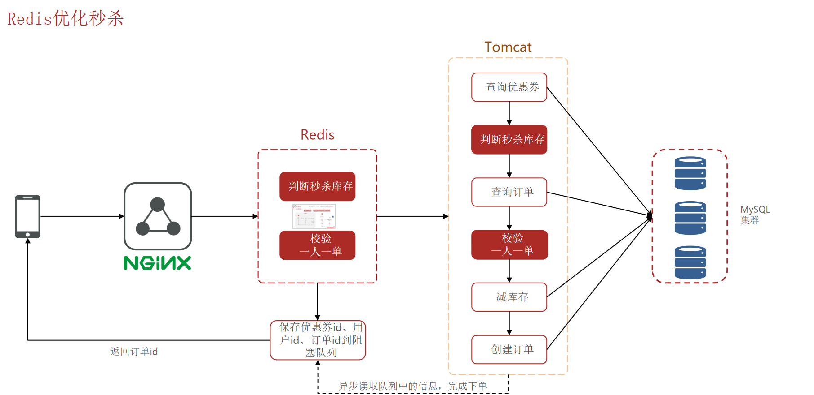
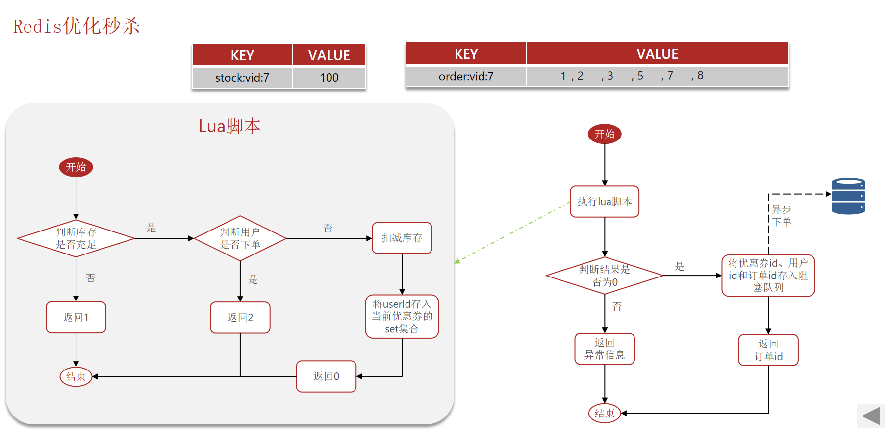
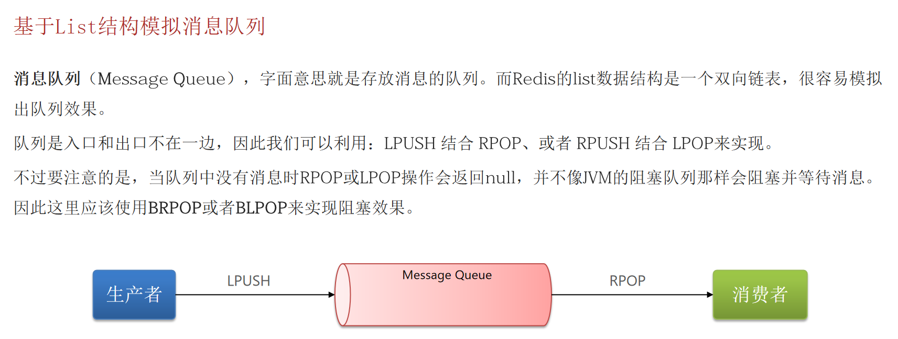
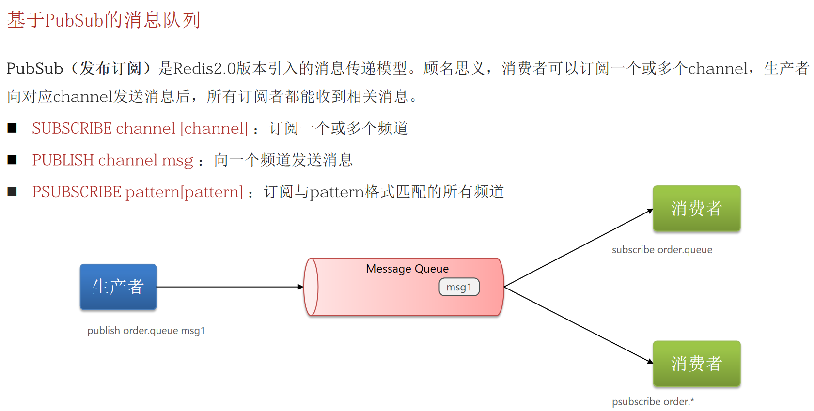

# 05 - 秒杀优化与 Redis 消息队列

## 1. 当前秒杀业务的瓶颈

### 1.1 回顾现有秒杀流程

```
用户请求 → 查询优惠券 → 判断秒杀时间 → 判断库存 → 一人一单校验
                                                    │
                                          ┌─────────┴─────────┐
                                          │  扣减库存 (MySQL)    │
                                          │  创建订单 (MySQL)    │
                                          └───────────────────┘
```

**问题**：整个流程是**串行同步**的，所有操作都在主线程中完成，Tomcat 线程池有限，高并发下：

| 瓶颈点 | 说明 |
|--------|------|
| **MySQL 读写压力大** | 查库存、扣库存、查订单、创订单全部走 MySQL |
| **响应时间长** | 用户要等所有 DB 操作完成才能收到响应 |
| **Tomcat 线程耗尽** | 每个请求占用一个线程，线程在等待 DB 时是阻塞状态 |
| **吞吐量低** | 串行同步模型，单机 QPS 有限 |

### 1.2 优化方向

```
优化前（同步串行）：
用户 ──→ [查DB] ──→ [判断] ──→ [扣库存DB] ──→ [创建订单DB] ──→ 返回结果
         ══════════════════ 一个长链路 ══════════════════

优化后（异步分离）：
用户 ──→ [Redis判断 + 扣库存(Lua)] ──→ 立即返回（订单ID）
                                            │
                                   ┌────────┴────────┐
                                   │   消息队列 (MQ)   │
                                   └────────┬────────┘
                                            │
                                   ┌────────┴────────┐
                                   │   异步下单线程    │
                                   │   (创建订单DB)   │
                                   └─────────────────┘
```
  
  

**核心思路 — 将业务拆分为两步**：
1. **快速返回**：Redis 中做资格校验 + 扣库存（Lua 原子脚本），返回订单号
2. **异步处理**：将创建订单等耗时操作丢给消息队列，后台慢慢处理

---

## 2. 秒杀资格判断前置到 Redis

### 2.1 库存预热

在秒杀开始前，将库存信息**预热到 Redis**：

```java
// 活动开始时执行一次
@PostConstruct  // 或通过管理接口触发
public void preheatStock(Long voucherId, Integer stock) {
    stringRedisTemplate.opsForValue()
        .set("seckill:stock:" + voucherId, stock.toString());
}
```

### 2.2 Lua 脚本实现原子判断 + 扣减

把「判断库存 + 判断一人一单 + 扣库存」全部写进一个 Lua 脚本，**一次 Redis 调用搞定**：

```lua
-- seckill.lua
-- KEYS[1]: 库存 key      (seckill:stock:10)
-- KEYS[2]: 订单 set key  (seckill:order:10)      存放已下单用户ID
-- ARGV[1]: 用户 ID
-- ARGV[2]: 订单 ID (提前生成，异步时使用)

-- 1. 判断库存是否充足
local stock = tonumber(redis.call('GET', KEYS[1]))
if stock == nil or stock <= 0 then
    return 1  -- 库存不足
end

-- 2. 判断用户是否已购买（一人一单）
local isMember = redis.call('SISMEMBER', KEYS[2], ARGV[1])
if isMember == 1 then
    return 2  -- 已经购买过了
end

-- 3. 扣减库存
redis.call('DECR', KEYS[1])

-- 4. 记录用户已购买
redis.call('SADD', KEYS[2], ARGV[1])

-- 5. 返回 0 表示成功（同时将订单信息放入队列，后续异步处理）
return 0
```

**返回值约定**：

| 返回值 | 含义 |
|--------|------|
| 0 | 抢购成功 |
| 1 | 库存不足 |
| 2 | 已购买过（一人一单） |

### 2.3 Java 调用 Lua 脚本

```java
private static final DefaultRedisScript<Long> SECKILL_SCRIPT;

static {
    SECKILL_SCRIPT = new DefaultRedisScript<>();
    SECKILL_SCRIPT.setLocation(new ClassPathResource("seckill.lua"));
    SECKILL_SCRIPT.setResultType(Long.class);
}

public Result seckillVoucher(Long voucherId, Long userId) {
    // 提前生成订单ID（雪花算法 or RedisIdWorker）
    long orderId = redisIdWorker.nextId("order");

    // 执行 Lua 脚本 — 原子的资格校验 + 扣库存
    Long result = stringRedisTemplate.execute(
        SECKILL_SCRIPT,
        Arrays.asList(
            "seckill:stock:" + voucherId,   // KEYS[1]
            "seckill:order:" + voucherId     // KEYS[2]
        ),
        userId.toString(),                   // ARGV[1]
        String.valueOf(orderId)              // ARGV[2]
    );

    // 根据返回值判断结果
    if (result == 1) {
        return Result.fail("库存不足！");
    }
    if (result == 2) {
        return Result.fail("每人限购一单！");
    }

    // 抢购成功 → 返回订单ID（订单创建走异步）
    return Result.ok(orderId);
}
```

> **关键优化**：整个资格校验 + 扣库存过程只访问 Redis，不碰 MySQL，单次 Redis 调用（Lua 脚本）即可完成，耗时在毫秒级。

---

## 3. 认识消息队列 — 解决异步下单

### 3.1 什么是消息队列？

消息队列（Message Queue，简称 MQ）是一种**异步通信**机制：

```
生产者 ──→ [消息队列] ──→ 消费者
           (暂存消息)
```

- **生产者**：发送消息的一方（秒杀业务中 = 抢购成功后的订单创建）
- **消费者**：接收并处理消息的一方（后台线程，负责写 MySQL 订单）
- **消息队列**：存储消息的中间件，起到**解耦、削峰、异步**的作用

### 3.2 消息队列在本场景中的作用

```
高并发请求                                         后台处理
  │                                               │
  ├─ 请求1 ──→ [Redis 秒杀判断] ──→ 发消息 ─┐     │
  ├─ 请求2 ──→ [Redis 秒杀判断] ──→ 发消息 ─┤     │
  ├─ 请求3 ──→ [Redis 秒杀判断] ──→ 返回 ──┐ │     │
  │                                       │ │     │
  │  (前端先拿到结果，不用等DB写入)          │ │     │
  │                                       │ │     │
  └───────────────────────────────────────┘ │ │     │
                                            ▼ ▼     ▼
                                     ┌─────────────────┐
                                     │   消息队列 (MQ)   │  ← 削峰：请求再多，MQ 先接着
                                     └─────────────────┘
                                            │
                                            ▼
                                     ┌─────────────────┐
                                     │   异步消费者线程   │  ← 按自己的速度慢慢处理
                                     │   创建订单 (MySQL) │
                                     └─────────────────┘
```

**三大作用**：
- **异步**：用户不用等写 DB，先拿到结果
- **解耦**：秒杀判断和订单创建是两个独立模块
- **削峰**：MQ 堆积消息，消费者匀速处理，保护 MySQL

---

## 4. Redis 实现消息队列的三种方式

### 4.1 方式一：List 模拟队列

#### 原理

Redis 的 List 数据结构天然支持队列操作：
  


```
生产者 LPUSH ──→ [  List  ] ──→ BRPOP 消费者
                   msg3
                   msg2
                   msg1
```

| 命令 | 说明 |
|------|------|
| `LPUSH queue msg` | 从左边入队（生产者） |
| `RPOP queue` | 从右边出队（消费者，无消息时返回 nil） |
| `BRPOP queue timeout` | **阻塞式**出队，无消息时阻塞等待，超时返回 nil |

#### 代码实现

```java
// ========== 生产者 ==========
public void sendOrderMessage(Long voucherId, Long userId, Long orderId) {
    // 封装消息
    VoucherOrder order = new VoucherOrder();
    order.setVoucherId(voucherId);
    order.setUserId(userId);
    order.setId(orderId);
    String msg = JSON.toJSONString(order);
    // 发送到队列
    stringRedisTemplate.opsForList().leftPush("stream.orders", msg);
}

// ========== 消费者（独立线程不断轮询） ==========
@Component
public class OrderConsumer implements InitializingBean {

    @Resource
    private StringRedisTemplate stringRedisTemplate;

    private static final ExecutorService WORKER = Executors.newSingleThreadExecutor();

    @Override
    public void afterPropertiesSet() {
        WORKER.submit(() -> {
            while (true) {
                try {
                    // BRPOP 阻塞等待，超时 5 秒
                    String msg = stringRedisTemplate.opsForList()
                        .rightPop("stream.orders", 5, TimeUnit.SECONDS);
                    if (msg != null) {
                        // 处理订单
                        handleOrder(msg);
                    }
                } catch (Exception e) {
                    log.error("处理订单异常", e);
                    // 异常处理：可以放回队列或记录失败日志
                }
            }
        });
    }

    private void handleOrder(String msg) {
        VoucherOrder order = JSON.parseObject(msg, VoucherOrder.class);
        // 创建订单 (MySQL)
        // ...
    }
}
```

#### List 方案的优缺点

| 优点 | 缺点 |
|------|------|
| 实现简单，Redis 自带 | **不支持消息确认**：消费者拿到消息后如果崩溃，消息就丢了 |
| BRPOP 支持阻塞等待 | **不支持消息持久化**：Redis 宕机，消息丢失（除非 AOF/RDB） |
| | **一条消息只能被一个消费者消费**：没法做消费者组 |
| | **没有消息回溯**：消费了就没了 |

---

### 4.2 方式二：Pub/Sub（发布订阅）

#### 原理
  


```
生产者 PUBLISH                   消费者1 SUBSCRIBE
  channel:order    ─────────→   收到消息 ✅
                                消费者2 SUBSCRIBE
                                收到消息 ✅
                                消费者3 SUBSCRIBE
                                收到消息 ✅
```

| 命令 | 说明 |
|------|------|
| `PUBLISH channel msg` | 生产者发布消息 |
| `SUBSCRIBE channel` | 消费者订阅频道 |

#### 代码示例

```java
// ========== 消费者 ==========
@Component
public class OrderSubscriber implements InitializingBean {

    @Resource
    private StringRedisTemplate stringRedisTemplate;

    @Override
    public void afterPropertiesSet() {
        // 注册订阅
        stringRedisTemplate.getConnectionFactory()
            .getConnection()
            .subscribe((message, pattern) -> {
                // 收到消息后处理
                String msg = new String(message.getBody());
                handleOrder(msg);
            }, "channel:order".getBytes());
    }
}
```

#### Pub/Sub 的致命缺陷

| 问题 | 说明 |
|------|------|
| **消息不持久化** | 发布的消息**不会存储**，如果没有消费者在线，消息直接丢失 |
| **无法堆积** | 没有队列缓冲，消费者处理不过来时消息照样丢 |
| **不支持重试** | 消息处理失败无法回溯 |

> **结论**：Pub/Sub 适用于**实时通知**（如聊天消息、广播），**不适合**业务消息处理（如订单创建）。本场景 **❌ 不推荐**。

---

### 4.3 方式三：Stream（Redis 5.0+，推荐）

#### 原理

Stream 是 Redis 5.0 引入的**真正意义上的消息队列**数据结构，功能接近 Kafka/RocketMQ：

```
         ┌─────────── Stream ───────────┐
         │  msg1   msg2   msg3   msg4   │
         │   ↓      ↓      ↓      ↓     │
Producer ──→ XADD ──→  ...  ──→ XREAD ──→ Consumer
                              ──→ XREADGROUP ──→ Consumer Group
```

#### Stream 核心命令

| 命令 | 说明 |
|------|------|
| `XADD stream.orders * key value ...` | 添加消息，`*` 表示自动生成 ID |
| `XREAD COUNT 1 STREAMS stream.orders 0` | 读取消息（从指定 ID 开始，0=从头） |
| `XREAD COUNT 1 BLOCK 2000 STREAMS stream.orders $` | **阻塞**读取，`$`=只读新消息 |
| `XGROUP CREATE stream.orders g1 $` | 创建消费者组，`$`=从最新消息开始 |
| `XREADGROUP GROUP g1 c1 COUNT 1 STREAMS stream.orders >` | 消费者组读取，`>`=只读未分配给自己的 |
| `XACK stream.orders g1 msgId` | **消息确认**，该消息才算真正消费完成 |
| `XPENDING stream.orders g1` | 查看 pending（已读取但未确认）的消息 |
| `XLEN stream.orders` | 查看 Stream 长度（消息数量） |

#### Stream 的关键特性

```
消费者组模型：

     ┌──────────── Stream ────────────┐
     │  msg1  msg2  msg3  msg4  msg5  │
     └──────┬──────────────┬──────────┘
            │              │
     ┌──────▼──────┐ ┌─────▼──────┐
     │ Consumer Group "g1"         │
     │  ┌────────┐   ┌────────┐   │
     │  │ c1消费  │   │ c2消费  │   │  ← 同组内消息负载均衡，一条消息只被一个消费者处理
     │  │ msg1,3  │   │ msg2,4  │   │
     │  └────────┘   └────────┘   │
     └────────────────────────────┘
     
消息确认机制：
- XREADGROUP 读取消息 → 消息进入 pending 状态（未确认）
- 消费者处理完成 → XACK 确认 → 消息从 pending 移除
- 消费者崩溃 → 消息留在 pending → 其他消费者可接手 → **保证消息不丢**
```

#### Java 代码实现

**生产者**：

```java
public void sendOrderMessage(Long voucherId, Long userId, Long orderId) {
    VoucherOrder order = new VoucherOrder();
    order.setVoucherId(voucherId);
    order.setUserId(userId);
    order.setId(orderId);

    Map<String, String> message = new HashMap<>();
    message.put("data", JSON.toJSONString(order));

    // XADD stream.orders * key1 val1 key2 val2 ...
    stringRedisTemplate.opsForStream()
        .add("stream.orders", message);
}
```

**消费者 — 基于消费者组**：

```java
@Component
public class StreamOrderConsumer implements InitializingBean {

    @Resource
    private StringRedisTemplate stringRedisTemplate;

    private static final String STREAM_KEY = "stream.orders";
    private static final String GROUP_NAME = "order-group";
    private static final String CONSUMER_NAME = "consumer-" + UUID.randomUUID();

    @PostConstruct
    public void init() {
        // 消费者组不存在时自动创建
        try {
            stringRedisTemplate.opsForStream()
                .createGroup(STREAM_KEY, ReadOffset.from("0"), GROUP_NAME);
        } catch (Exception e) {
            // MKSTREAM | CREATE：组已存在时会报错，忽略
        }
    }

    @Override
    public void afterPropertiesSet() {
        Executors.newSingleThreadExecutor().submit(() -> {
            while (true) {
                try {
                    // 1. 从 Stream 中读取分配给自己的消息（阻塞等待 2 秒）
                    List<MapRecord<String, Object, Object>> records =
                        stringRedisTemplate.opsForStream()
                            .read(
                                Consumer.from(GROUP_NAME, CONSUMER_NAME),
                                StreamReadOptions.empty().count(1).block(Duration.ofSeconds(2)),
                                StreamOffset.create(STREAM_KEY, ReadOffset.lastConsumed())
                            );

                    if (records == null || records.isEmpty()) {
                        // 检查 pending 消息（处理过的但未确认的，可能是之前崩溃留下的）
                        handlePendingMessages();
                        continue;
                    }

                    // 2. 处理消息
                    for (MapRecord<String, Object, Object> record : records) {
                        try {
                            Map<Object, Object> value = record.getValue();
                            String data = (String) value.get("data");
                            handleOrder(data);
                            // 3. 确认消息（XACK）
                            stringRedisTemplate.opsForStream()
                                .acknowledge(STREAM_KEY, GROUP_NAME, record.getId());
                        } catch (Exception e) {
                            log.error("处理订单失败", e);
                            // 不 XACK → 消息留在 pending → 等待重试或人工处理
                        }
                    }
                } catch (Exception e) {
                    log.error("消费者异常", e);
                    // 异常时稍等再继续，避免 CPU 空转
                    Thread.sleep(1000);
                }
            }
        });
    }

    // 处理 pending 消息（之前取走了但没确认的）
    private void handlePendingMessages() {
        PendingMessages pending = stringRedisTemplate.opsForStream()
            .pending(STREAM_KEY, GROUP_NAME, Range.unbounded(), 10);

        for (PendingMessage msg : pending) {
            // 重新处理或告警
            log.warn("发现未确认消息：{}", msg.getId());
            // 查看消息详情
            List<MapRecord<String, Object, Object>> records =
                stringRedisTemplate.opsForStream()
                    .range(STREAM_KEY, Range.just(msg.getIdAsString()));
            // 重新处理...
        }
    }
}
```

---

## 5. 三种队列方案对比

| 特性 | List (BRPOP) | Pub/Sub | Stream |
|------|:--:|:--:|:--:|
| 消息持久化 | ⚠️ 依赖 RDB/AOF | ❌ 不持久化 | ✅ 持久化到磁盘 |
| 消息确认 (ACK) | ❌ | ❌ | ✅ XACK |
| 消费者组 | ❌ | ❌ | ✅ 同组内负载均衡 |
| 消息回溯 | ❌ | ❌ | ✅ 按消息 ID 或时间读取 |
| 消息堆积 | ✅ | ❌ (直接丢失) | ✅ |
| 阻塞读取 | ✅ BRPOP | ❌ (push 模式) | ✅ BLOCK 参数 |
| 实现复杂度 | ⭐ | ⭐ | ⭐⭐⭐ |
| 适用场景 | 简单队列，可容忍少量消息丢失 | 实时通知（聊天、广播） | **业务消息处理（推荐）** |
| 本场景推荐 | ⚠️ 不推荐 | ❌ 不推荐 | ✅ **推荐** |

---

## 6. 优化后的完整秒杀流程

### 6.1 架构图

```
┌─────────────────────────────────────────────────────────────┐
│                         用户请求                              │
└─────────────────────────────────────────────────────────────┘
                              │
                              ▼
┌─────────────────────────────────────────────────────────────┐
│  ① Redis Lua 原子操作（毫秒级）                                │
│     - 判断库存 (GET stock)                                    │
│     - 判断一人一单 (SISMEMBER)                                 │
│     - 扣减库存 (DECR stock)                                   │
│     - 记录用户 (SADD orderSet)                                │
│     ──→ 成功则返回订单ID                                     │
└─────────────────────────────────────────────────────────────┘
                              │
                     ┌───────┴───────┐
                     │               │
                     ▼               ▼
              ┌────────────┐  ┌──────────────┐
              │  返回前端    │  │ ② XADD      │
              │  "抢购成功"  │  │  发送到       │
              │             │  │  Stream      │
              └────────────┘  └──────────────┘
                                     │
                                     ▼
                              ┌──────────────┐
                              │ Redis Stream │
                              │  (消息持久化)  │
                              └──────────────┘
                                     │
                                     ▼
                              ┌──────────────┐
                              │ ③ 消费者线程  │
                              │  XREADGROUP  │
                              └──────────────┘
                                     │
                              ┌──────┴──────┐
                              │  处理订单     │
                              │  ┌────────┐ │
                              │  │创建订单  │ │
                              │  │(MySQL) │ │
                              │  │扣库存   │ │
                              │  │(MySQL) │ │
                              │  └────────┘ │
                              │  ④ XACK确认  │
                              └─────────────┘
```

### 6.2 完整代码串联

```java
// ========== Controller 层 ==========
@PostMapping("/seckill/{voucherId}")
public Result seckillVoucher(@PathVariable Long voucherId) {
    Long userId = UserHolder.getUser().getId();
    return voucherOrderService.seckillVoucher(voucherId, userId);
}

// ========== Service 层 ==========
@Override
public Result seckillVoucher(Long voucherId, Long userId) {
    // 1. 提前生成订单ID
    long orderId = redisIdWorker.nextId("order");

    // 2. 执行 Lua 脚本：资格校验 + 扣库存
    Long result = stringRedisTemplate.execute(
        SECKILL_SCRIPT,
        Arrays.asList(
            "seckill:stock:" + voucherId,
            "seckill:order:" + voucherId
        ),
        userId.toString(),
        String.valueOf(orderId)
    );

    if (result != 0) {
        return result == 1 ? Result.fail("库存不足") : Result.fail("已购买过");
    }

    // 3. Lua 成功 → 发送消息到 Stream（异步下单）
    VoucherOrder order = new VoucherOrder();
    order.setId(orderId);
    order.setUserId(userId);
    order.setVoucherId(voucherId);

    Map<String, String> message = new HashMap<>();
    message.put("data", JSON.toJSONString(order));
    stringRedisTemplate.opsForStream().add("stream.orders", message);

    // 4. 立即返回（不等待 MySQL 写入）
    return Result.ok(orderId);
}
```

---

## 7. 总结

### 7.1 秒杀优化的三个核心思想

| 思想 | 具体做法 |
|------|----------|
| **异步** | 资格校验后立即返回，订单创建走 MQ 异步处理 |
| **解耦** | Redis 负责秒杀判断（快），MySQL 负责订单持久化（稳），互不干扰 |
| **削峰** | 消息队列作为缓冲，后台消费者按自身速度处理 |

### 7.2 核心知识点速查

| 知识点 | 核心要点 |
|--------|----------|
| 库存预热 | 秒杀前把库存数据加载到 Redis |
| Lua 原子脚本 | 库存判断 + 一人一单 + 扣库存一次完成 |
| 消息队列作用 | 异步、解耦、削峰 |
| List 队列 | LPUSH/BRPOP 模拟，简单但消息不持久、无 ACK |
| Pub/Sub | 实时广播，消息不持久化，不适合业务场景 |
| Stream | Redis 5.0+ 的正式 MQ，支持 ACK、消费者组、消息回溯 |
| XADD | 生产消息 |
| XREADGROUP | 消费者组模式读取 |
| XACK | 消息确认，防止丢失 |
| XPENDING | 检查未确认消息，处理异常 |

### 7.3 技术选型建议

- **学习/简单场景**：Redis Stream 足够，无需额外中间件
- **中小型项目**：Redis Stream 或 RabbitMQ
- **大型/高要求项目**：RocketMQ（阿里系、事务消息）、Kafka（大数据、日志场景）
- **Redis Stream 适用**：不想引入额外中间件、消息量适中、需要 ACK 机制的异步场景
